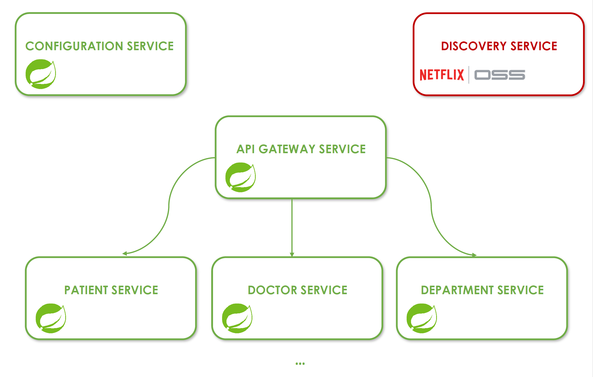

<a name="readme-top"></a>
<br />
<div align="center">
  <a href="#">
   <!-- Replace this logo for a custom official logo -->
    
  </a>

<h1 align = "center">
<b><i>PolyLab</i></b>
</h1>
    <!-- Add/Remove categories depending on your project -->
  <p align="center">
    A sample microservice-based LIMS
    <br />
    <!-- IMPORTANT NOTE: If you want to append emojis you'll need to add the '-' sign before and after the header, as shown below:  -->
    <a href="#features">Features</a>
    ·
    <a href="#-requirements-">Requirements</a>
    ·
    <a href="#-architecture-">Architecture</a>
    ·
     <a href="#-technologies-">Technologies</a>
    ·
    <a href="#-license-">License</a>
  </p>
</div>

<!-- Here goes the project description -->
This project contains the maintenance module of a laboratory information management system that can be used by multiple
users, following minimalist concepts of tactical DDD.

It is built using Spring Boot and Netflix Eureka for service discovery and registration, as well as both the Java & Kotlin programming language.

Note that a laboratory information system (LIS) is a series of computer programs that process, store and manage data
from all stages of medical processes and biochemical assays. Doctors and laboratory technicians use laboratory
information systems to monitor a variety of inpatient and outpatient patients, including hematology, chemistry,
immunology and microbiology.

## Features

- Provide a scalable and modular architecture for managing laboratory data.
- Support CRUD (Create, Read, Update, Delete) operations for various entities, such as samples, tests, and users.
- Ensure high availability and fault tolerance through microservice-based architecture.
- Enable seamless communication between different services using RESTful APIs.
- Implement service discovery and registration for efficient inter-service communication.

## 📝 Requirements 📝

This project
requires [JDK 17](https://docs.aws.amazon.com/corretto/latest/corretto-17-ug/downloads-list.html) & [MySQL](https://dev.mysql.com/downloads/installer/).

If you have that installed you can just clone the repository by entering:

```bash
git clone https://github.com/jxareas/PolyLab.git
```

<p align="right">(<a href="#readme-top">back to top</a>)</p>

## 🛠 Architecture 🛠

Our sample microservices-based laboratory information management system consists of the following modules (as of now):

1. **PolyLab-API Gateway**: Acts as the entry point for incoming requests, handles authentication, and routes requests
   to the appropriate microservices.
2. **PolyLab-Service Registry (Netflix Eureka)**: Provides service discovery and registration functionality, allowing
   services to find and communicate with each other.
3. **Microservices**:
    - **Doctor Service**: Manages operations related to doctors, including creation, retrieval, updating, and deletion.
    - **Exam Service**: Handles exams-related operations, such as creating tests, assigning them to samples, and
      retrieving test results.
    - **User Service**: Deals with user management, including user registration, authentication, and authorization.
4. **Database**: Each microservice has its dedicated database (e.g., MySQL or PostgreSQL) for storing and retrieving
   data related to its domain.

The following picture illustrates the architecture described above.



## 🦾 Technologies 🦾

The PolyLab-API utilizes the following technologies:

- **Spring Boot**: A Java framework that simplifies the development of microservices, providing features like dependency
  injection, RESTful web services, and robust error handling.
- **Netflix Eureka**: A service registry and discovery tool that enables efficient communication between microservices.
- **Spring Cloud Netflix Zuul**: Acts as an API gateway, providing dynamic routing, filtering, and load balancing
  capabilities for incoming requests to the microservices.
- **Spring Cloud Config Server**: Manages centralized configuration for the microservices, allowing dynamic
  configuration changes without redeploying the services.
- **Spring Data JPA**: Provides support for data persistence and access using the Java Persistence API (JPA) and
  object-relational mapping (ORM).
- **MySQL/PostgreSQL**: Relational database management systems used for storing and retrieving data.
- **Spring Security**: Enables secure authentication and authorization for API endpoints.
- **Lombok**: A Java library that reduces boilerplate code by automatically generating getters, setters, constructors,
  and other common code patterns.
- **ModelMapper**: A mapping library that simplifies the conversion between different Java objects, making it easier to
  map data entities to DTOs (Data Transfer Objects) and vice versa.
- **Spring Boot Validation (JSR-380)**: Provides a validation framework for validating input data using annotations,
  ensuring that the data meets the specified constraints and rules.
- **Spring HATEOAS**: A library that helps build RESTful APIs following the HATEOAS principle, allowing for the creation
  of self-descriptive APIs by adding hypermedia links to the responses.
- **Open API 3 (Swagger)**: A tool for generating interactive API documentation, making it easier for developers to
  understand and consume the API.

By leveraging these technologies, PolyLab-API offers a scalable, modular, and robust solution for managing laboratory
data.

<p align="right">(<a href="#readme-top">back to top</a>)</p>

## 📜 License 📜

<!-- Change this license for the one used in your project -->

PolyLab is licensed under the [GNU Affero GPL v3.0](https://github.com/jxareas/PolyLab/blob/master/LICENSE).

<p align="right">(<a href="#readme-top">back to top</a>)</p>


<!-- This is a custom version of the Read-My-README template, by Jon Areas,
found at: https://github.com/jxareas/read-my-readme -->
